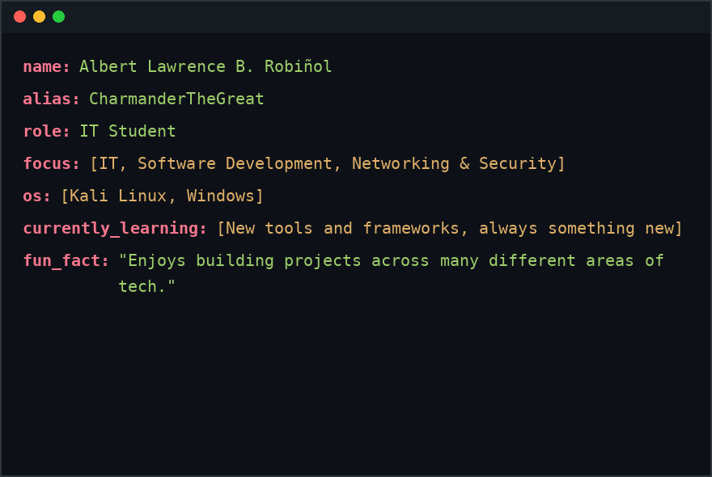
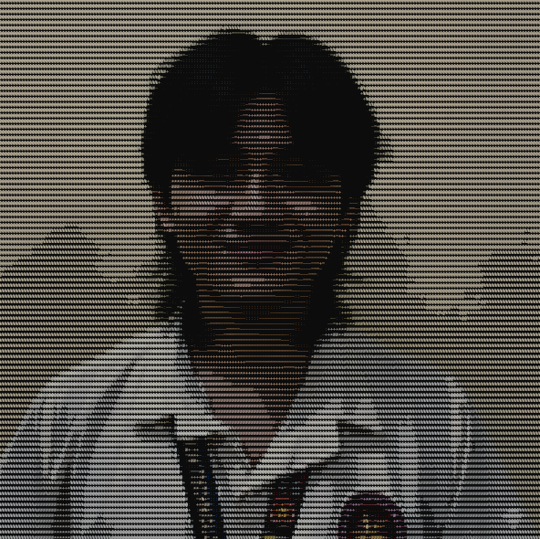
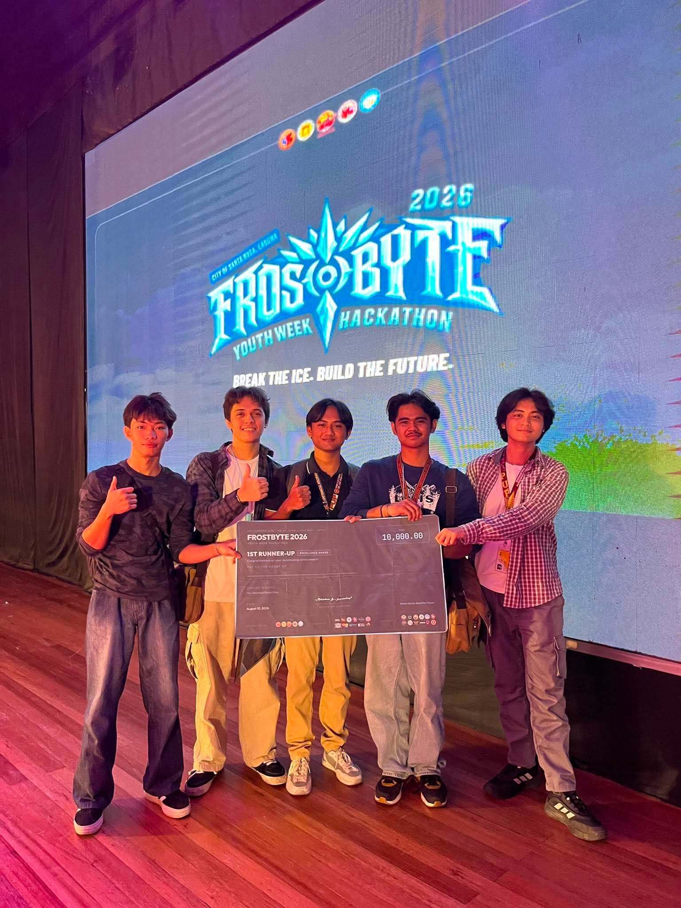
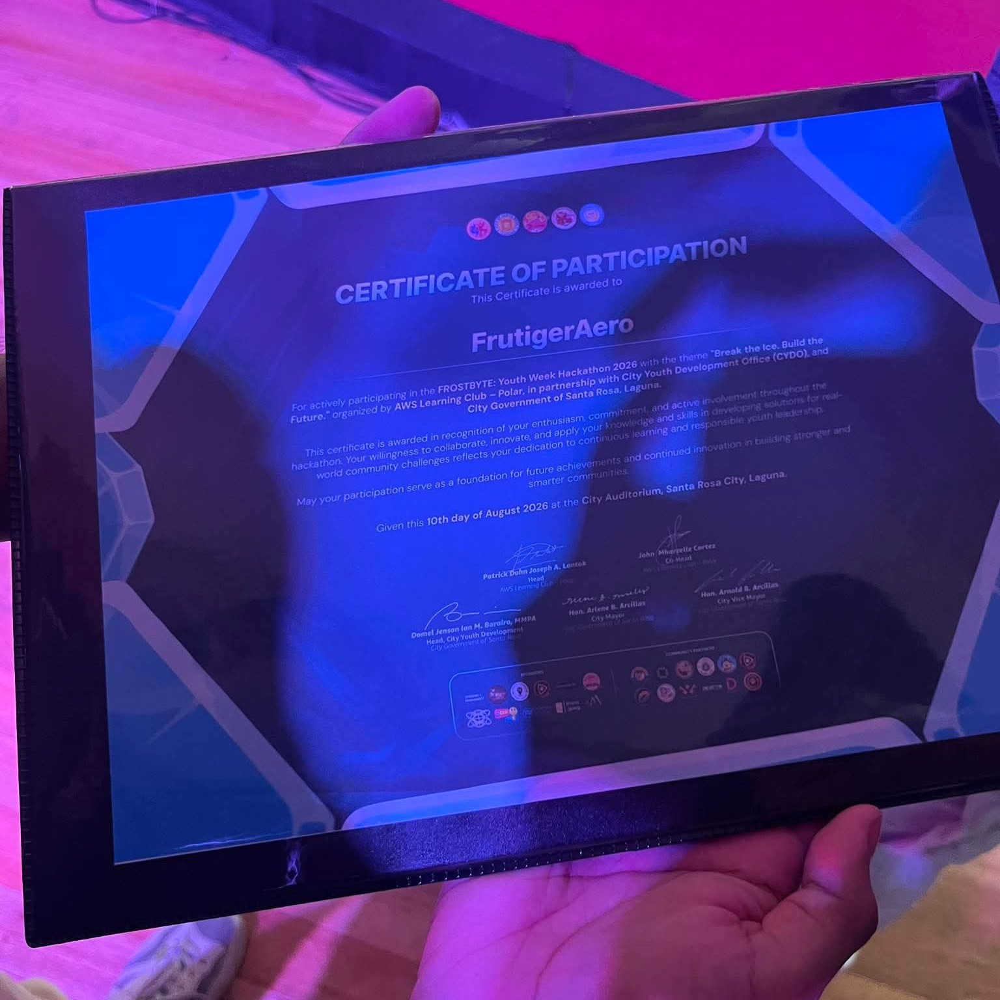

  

<h3 align="center">💡 Learning, building, and figuring things out one project at a time.</h3>

  
  

---

### 🧑‍💻 About Me

<table>
<tr>
<td width="60%">

</td>
<td width="40%" align="center">

</td>
</tr>
</table>

 

### ⚡ Tech Stack

 

### 🛠️ Tools & Platforms

---

### 📊 GitHub Stats

  
  

  
  

---

### 🏆 Achievements

**🥈 1st Runner-Up — Excellence Award**
**FROSTBYTE 2026: Youth Week Hackathon**
*"Break the Ice, Build the Future" — City of Santa Rosa, Laguna*

 

<table width="70%" align="center">
<tr>
<td width="50%">

</td>
<td width="50%">

</td>
</tr>
</table>

---

### 🚀 Featured Projects

  
  

---

### 🌐 Connect With Me

---

### 🐍 Contribution Snake

 

  

<i>"Still figuring it out — one project, one bug, one lesson at a time."</i>
